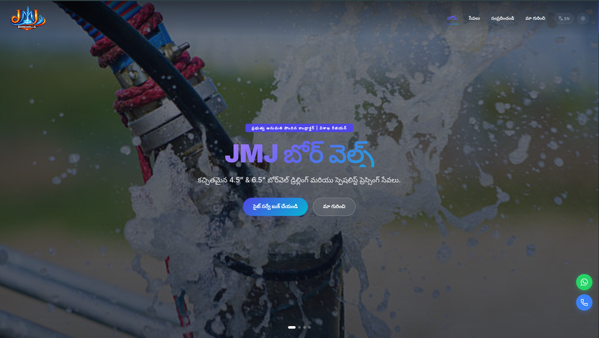
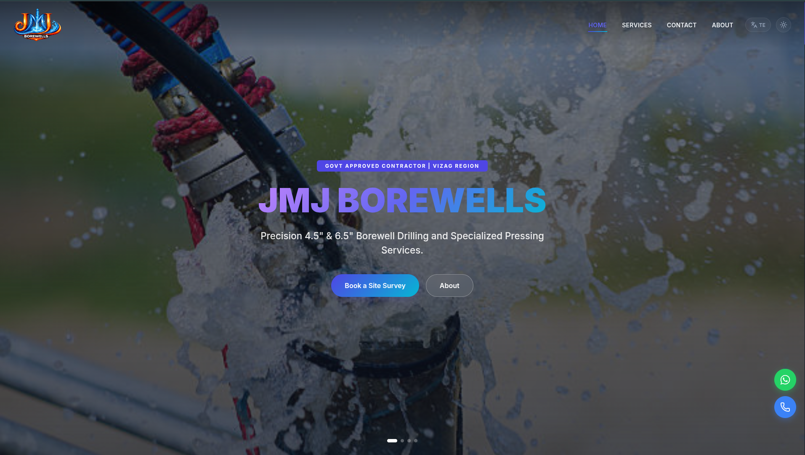

# JMJ Borewells Website

Official website for JMJ Borewells. This is a responsive single-page web application built with React and Vite to present borewell services, company information, contact details, and customer enquiry options.

## Live Website

[https://RapetiRuchitha.github.io/jmj/](https://RapetiRuchitha.github.io/jmj/)

## Preview

### Telugu Version



### English Version



## Features

- Responsive single-page layout
- English and Telugu language support
- Dark and light theme toggle
- Hero image slider
- Services section with pricing details
- Location section with Google Maps
- About section with company overview
- FAQ section
- Customer testimonials
- Floating Call and WhatsApp buttons
- WhatsApp-based enquiry form

## Contact Information

- Phone: +91 91001 11643
- Email: jmjborewell@gmail.com
- Address: Ramanyapeta, Near RCM Church, Chodavaram, Anakapalle District, Andhra Pradesh, 531036

## Tech Stack

### Frontend

- React
- Vite
- Framer Motion
- Lucide React
- React Icons
- CSS Modules

### Backend

- Express
- CORS

## Project Structure

```text
jmj/
├── English_version.png
├── Telugu_version.png
├── backend/
│   ├── package.json
│   └── server.js
├── frontend/
│   ├── public/
│   │   ├── manifest.json
│   │   └── images/
│   │       ├── logo.png
│   │       ├── logo1.png
│   │       ├── slide1.jpeg
│   │       ├── slide2.jpeg
│   │       ├── slide3.jpg
│   │       └── slide4.jpg
│   ├── src/
│   │   ├── App.jsx
│   │   ├── App.module.css
│   │   ├── LanguageContext.jsx
│   │   ├── main.jsx
│   │   ├── translations.js
│   │   ├── components/
│   │   │   ├── ErrorBoundary.jsx
│   │   │   ├── Faq.jsx
│   │   │   ├── Faq.module.css
│   │   │   ├── FloatingButtons.jsx
│   │   │   ├── FloatingButtons.module.css
│   │   │   ├── Footer.jsx
│   │   │   ├── Footer.module.css
│   │   │   ├── Navbar.jsx
│   │   │   ├── Navbar.module.css
│   │   │   ├── SurveyForm.jsx
│   │   │   └── SurveyForm.module.css
│   │   ├── pages/
│   │   │   ├── About.jsx
│   │   │   ├── About.module.css
│   │   │   ├── Home.jsx
│   │   │   ├── Home.module.css
│   │   │   ├── Location.jsx
│   │   │   ├── Location.module.css
│   │   │   ├── Services.jsx
│   │   │   └── Services.module.css
│   │   └── styles/
│   │       ├── global.css
│   │       └── variables.css
│   ├── index.html
│   ├── package.json
│   └── vite.config.js
└── README.md
```

## Local Development

### Prerequisites

- Node.js 18 or later
- npm

### Frontend

```bash
cd frontend
npm install
npm run dev
```

Runs on: http://localhost:2005

### Backend

```bash
cd backend
npm install
npm start
```

Runs on: http://localhost:3000

## Notes

- The current enquiry flow opens WhatsApp with a prefilled message.
- Telugu is the default language in the app.
- Main website content is managed in `frontend/src/translations.js`.

## License

This project is private and proprietary to JMJ Borewells.
